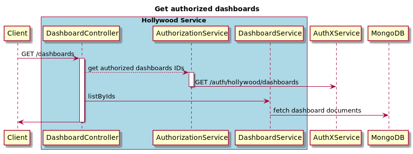

# Hollywood Service

[](https://jenkins.pibenchmark.com/job/HOL/job/hollywood-service/job/develop/)

Hollywood Service API is Backend API for Hollywood component

Feel free to check specific details in Hollywood Confluence resources:
* [Hollywood API Confluence Space](https://confluence.pibenchmark.com/display/PLATHOLLYWOOD/Hollywood+Service+API) 


## Model

The service has 1 entity the dashboard. [Here the model](./src/main/kotlin/net/pi/platform/hollywood/model/Dashboard.kt)

## API

Here details of the available [API](./src/main/kotlin/net/pi/platform/hollywood/controller/DashboardController.kt)
## Architecture

 A self-contained service with its own storage mongoDB.
 
### AuthX Integration

 To be able to filter dashboards based on user authorization, we need to have:
  
  - configuration `auth.enabled` should be set to true.
  - configuration `authx.url` should be set to the base url of authX service
  - dashboards should be registered as resources in authX with the following path `/hollywood/dashboards/` .
  - User / dashboards should belongs to the same group. 



Check authX [documentation](https://bitbucket.pibenchmark.com/projects/AUTHX/repos/authx-service-kt/browse/README.md)

## Development 
### Packaging

Use gradle:

```sh
gradle clean build
```
all the unit tests will be executed and the package won't be built if some of them fail.

### Testing

#### Integration
```sh
gradle clean build integrationTest
```

#### End to End
```sh
gradle clean build e2eTest
```

## Deployment
For details on how deployment works please read section __Deployment__ at [predictx-ci](https://bitbucket.pibenchmark.com/projects/QA/repos/predictx-ci/browse/README.md)

### Kubernetes / GCP

This service is automatically rolled out to kubernetes clusters running on Google Cloud Platform

|Env  | GCP Project Name | Cluster Name|
|:---:|:----------------:|:-----------:|
|dev  | px-platform-dev  | dev-cluster 

## Miscellaneous

### Connect to hollywood-mongo
```sh
   kubectl port-forward -n hollywood-service-mongo mongo-0 27017:27017
```
Use your preferred mongo db client to connect on localhost:27017

